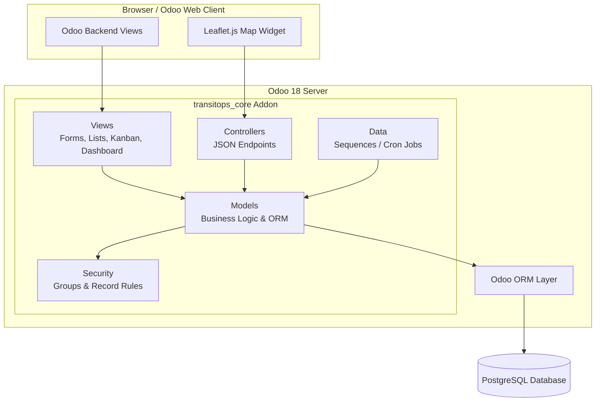
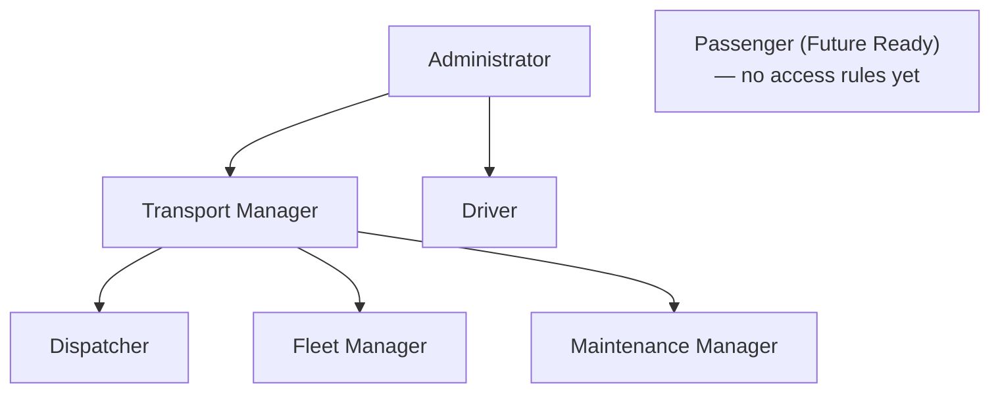
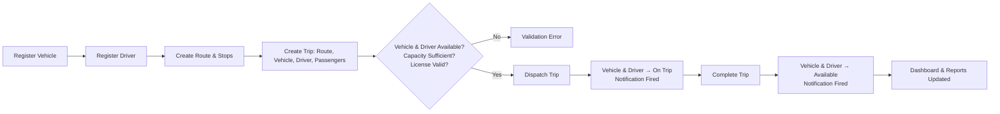
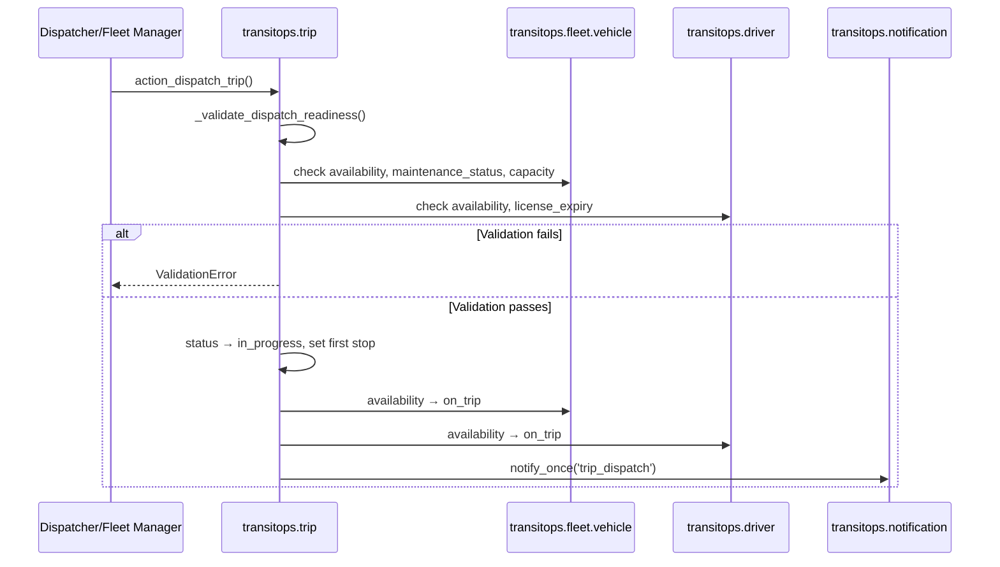
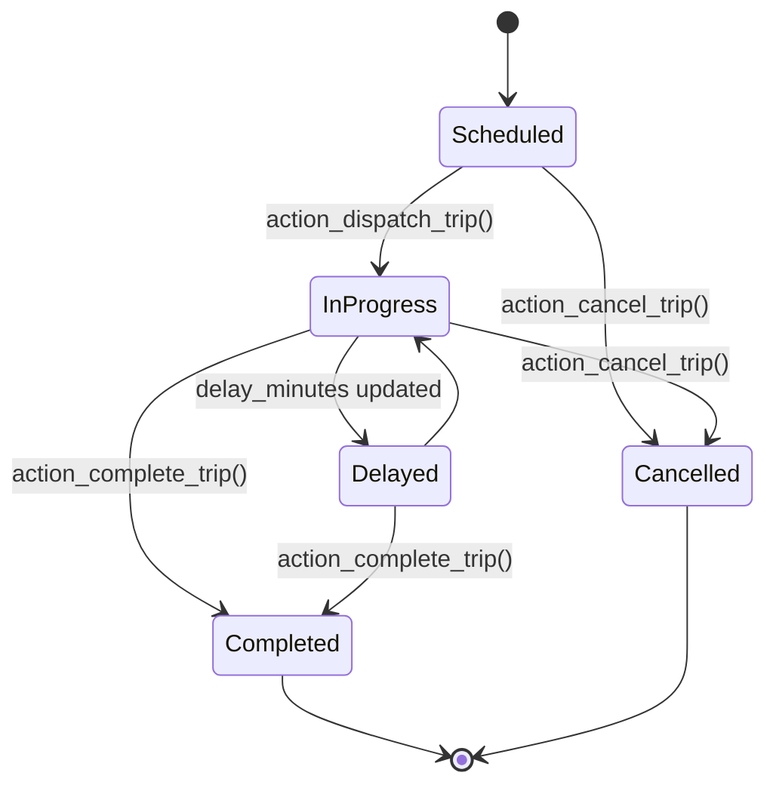
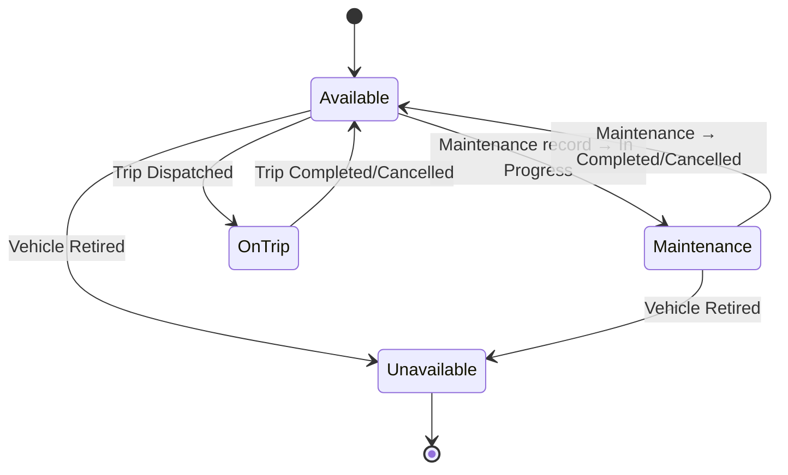
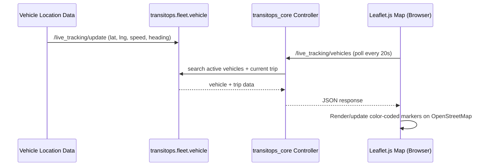

# TransitOps – Smart Transport Operations Platform

**An Odoo 18 Custom Addon for Fleet, Driver, Trip, Maintenance, and Incident Operations**

Built for **Odoo Hackathon 2026** · Backend implementation complete

---

## 1. Project Overview

TransitOps is a custom Odoo 18 addon (`transitops_core`) that digitizes core transport operations for fleet-based organizations. It centralizes vehicle registry, driver management, route/stop planning, trip dispatching, maintenance workflows, incident logging, automated notifications, role-based access control, and live vehicle tracking on OpenStreetMap — all built natively on the Odoo ORM, security, and view layers.

This README documents what is **actually implemented in the repository** (`backend/transitops_core/`) as of the current submission, and separately lists what the hackathon problem statement describes but that is **not yet built**, under Future Scope.

---

## 2. Problem Statement

Per the official Odoo Hackathon 2026 brief, many logistics companies still rely on spreadsheets and manual logbooks to manage transport operations, leading to:

- Scheduling conflicts between vehicles and drivers
- Underutilized or misallocated vehicles
- Missed or untracked maintenance cycles
- Expired driver licenses going unnoticed
- Inaccurate expense and fuel cost tracking
- Poor real-time operational visibility

**Goal:** Build a centralized platform managing the full lifecycle of transport operations while enforcing business rules automatically.

### Target Users (as defined in the problem statement)

| Role | Responsibility |
|---|---|
| Fleet Manager | Oversees fleet assets, maintenance, vehicle lifecycle, and operational efficiency |
| Driver | Creates/executes trips, monitors active deliveries |
| Safety Officer | Ensures driver compliance, tracks license validity and safety scores |
| Financial Analyst | Reviews expenses, fuel consumption, maintenance costs, and profitability |

> **Note on roles:** The implemented security model (Section 11) uses Odoo security groups named **Dispatcher, Fleet Manager, Maintenance Manager, Driver, Transport Manager, Administrator**, plus a placeholder **Passenger (Future Ready)** group. These map operationally to the personas above (e.g., Maintenance Manager ≈ Safety/Maintenance oversight), but there is currently no group named "Safety Officer" or "Financial Analyst," and no dedicated financial/expense views exist yet — see Section 16.

---

## 3. Objectives

- Provide a single system of record for vehicles, drivers, trips, routes, and maintenance
- Enforce business rules automatically at the model layer (status transitions, capacity checks, license validity)
- Give operational visibility through an executive dashboard and reporting views
- Support secure, role-based access for different operational personas
- Provide live, map-based visibility into vehicle location and status
- Keep the entire solution native to the Odoo 18 platform

---

## 4. Key Features (Implemented)

- Role-based access control built on native Odoo security groups and record rules
- Vehicle registry with unique vehicle numbers, dual status tracking (lifecycle `status` + operational `availability`)
- Driver profile management with license expiry validation and dual status tracking
- Route and stop management with sequenced waypoints and route-level vehicle/driver assignment
- Trip lifecycle management (Scheduled → In Progress/Delayed → Completed/Cancelled) with automatic status propagation to vehicle and driver
- Maintenance workflow (Draft → Scheduled → In Progress → Completed/Cancelled) that automatically updates vehicle availability and computes a maintenance health score
- Incident logging tied to trips, vehicles, and drivers, with severity/category classification
- Automated, deduplicated in-app notifications (via scheduled cron jobs) for license/registration/insurance expiry, maintenance due dates, and trip/incident events
- Live vehicle tracking on OpenStreetMap via Leaflet.js, with a JSON controller API and 20-second auto-refreshing, color-coded markers
- Executive dashboard with computed KPIs, plus dedicated graph/pivot reporting views for fleet and driver utilization

---

## 5. Implemented Modules

| # | Module | Description |
|---|---|---|
| 1 | Fleet Management | Vehicle registry, dual status/availability lifecycle, maintenance health score |
| 2 | Driver Management | Driver profiles, license expiry validation, dual status/availability lifecycle |
| 3 | Route Management | Routes with source/destination, type, distance/duration, assigned vehicles & drivers |
| 4 | Stop Management | Sequenced stops per route with arrival/departure windows and geo-coordinates |
| 5 | Trip Management | Trip creation, dispatch, completion, cancellation with full validation |
| 6 | Dashboard & Analytics | Executive KPI dashboard + fleet/driver utilization graph & pivot reports |
| 7 | Incident Management | Incident logging linked to vehicle/driver/trip, with severity & status workflow |
| 8 | Maintenance Management | Maintenance records, automatic vehicle status sync, health scoring, cron reminders |
| 9 | Notification System | Deduplicated in-app notifications driven by daily scheduled actions (cron) |
| 10 | Authentication & RBAC | Native Odoo login, custom security groups, and driver-scoped record rules |
| 11 | Live Vehicle Tracking | OpenStreetMap/Leaflet.js map fed by a JSON controller API |

---

## 6. Problem Statement Mapping

| Requirement (Problem Statement) | Status | Module |
|---|---|---|
| Secure login (email & password) | ✅ Implemented | Authentication & RBAC (native Odoo auth) |
| Role-Based Access Control | ✅ Implemented | Security groups (Section 11) |
| Dashboard KPIs (vehicles, trips, drivers) | ✅ Implemented | Dashboard & Analytics |
| Fleet Utilization (%) KPI | ⚠️ Partial | Utilization shown via graph/pivot views, not a single computed % field |
| Dashboard filters (type, status, region) | ⚠️ Partial | Filters by vehicle type & availability/status exist; no "region" field/filter exists |
| Vehicle Registry (unique reg. no., name, type, capacity, odometer, cost, status) | ⚠️ Partial | Unique vehicle number, type, capacity, odometer, and status implemented; no separate name/model or acquisition-cost field |
| Driver Management (name, license no./category/expiry, contact, safety score, status) | ⚠️ Partial | Name, license number, license expiry, contact, and status implemented; no license category or safety-score field |
| Trip Management (source, destination, vehicle, driver, cargo weight, distance) | ⚠️ Partial | Route-based trip creation with vehicle/driver/distance implemented; capacity check uses passenger count, not cargo weight (no cargo-weight field) |
| Trip lifecycle: Draft → Dispatched → Completed → Cancelled | ⚠️ Partial | Implemented as Scheduled → In Progress/Delayed → Completed/Cancelled |
| Maintenance records & auto "In Shop" status | ✅ Implemented | Vehicle availability auto-syncs to `maintenance` when a record is `in_progress` |
| Fuel & Expense Management | ❌ Not Implemented | Future Scope |
| Reports & Analytics (fuel efficiency, cost, ROI) | ❌ Not Implemented | Future Scope |
| CSV / PDF export | ⚠️ Partial | Standard Odoo list export (XLSX/CSV) available; no custom export or PDF reports |
| Mandatory business rules (uniqueness, status guards, capacity checks) | ✅ Implemented | Enforced via model constraints (Section 12) |

---

## 7. System Architecture

TransitOps follows the standard Odoo addon architecture: models define business data and logic, views render backend UI, a controller layer exposes JSON endpoints for the live tracking map, and the security layer enforces RBAC across all modules.



---

## 8. Repository Structure

```
TransitOps-Odoo-Hackathon-2026/
│
├── assets/                     # Placeholder folder (README only)
├── backend/
│   └── transitops_core/        # Core Odoo 18 addon
│       ├── controllers/        # main.py – live tracking JSON endpoints
│       ├── data/               # Sequences, maintenance & notification cron jobs
│       ├── models/             # Vehicle, Driver, Route, Stop, Trip, Maintenance,
│       │                       # Incident, Notification, Dashboard, Dashboard Metric
│       ├── security/           # ir.model.access.csv, security groups & record rules
│       ├── static/src/         # js/ scss/ xml for the Leaflet live-tracking widget
│       ├── views/              # XML view definitions for every model + menus
│       ├── __init__.py
│       └── __manifest__.py
├── database/                   # Placeholder folder (README only)
├── docs/                       # Placeholder folder (README only)
├── frontend/                   # Placeholder folder (README only)
└── README.md
```

| Folder | Purpose |
|---|---|
| `assets/` | Reserved for diagrams/screenshots — currently empty (README only) |
| `backend/transitops_core/` | The complete, functional Odoo 18 addon (all business logic) |
| `database/` | Reserved for DB scripts/notes — currently empty (README only) |
| `docs/` | Reserved for additional documentation — currently empty (README only) |
| `frontend/` | Reserved for a standalone frontend — currently empty; the UI is the native Odoo web client plus the embedded Leaflet widget |

---

## 9. Technology Stack

| Layer | Technology |
|---|---|
| Framework | Odoo 18 |
| Backend Language | Python (Odoo ORM) |
| Database | PostgreSQL |
| Frontend / Views | Odoo QWeb, XML Views, Odoo Web Client (OWL components) |
| Live Map | OpenStreetMap tiles + Leaflet.js 1.9.4 (loaded via CDN) |
| API Layer | Odoo `http.Controller` JSON routes |
| Access Control | Odoo Security Groups & `ir.rule` record rules |
| Scheduling | Odoo `ir.cron` scheduled actions |

---

## 10. Module Descriptions

### 10.1 Authentication & RBAC
Uses Odoo's native login system. Six functional security groups are defined — **Dispatcher, Fleet Manager, Maintenance Manager, Driver, Transport Manager, Administrator** — plus a placeholder **Passenger (Future Ready)** group with no access rules yet. `Transport Manager` implies Dispatcher + Fleet Manager + Maintenance Manager; `Administrator` implies all groups. Access is enforced through `ir.model.access.csv`, and drivers are further restricted via `ir.rule` record rules to see only their own profile, trips, incidents, and notifications.

### 10.2 Fleet Management (Vehicle Registry)
`transitops.fleet.vehicle` stores a unique vehicle number, vehicle type (car/van/bus/truck/motorbike/other), integer capacity, fuel type, odometer, and location fields (latitude/longitude/speed/heading with live-update timestamp). Each vehicle carries **two independent status fields**: a lifecycle `status` (Active / Inactive / Retired) and an operational `availability` (Available / Assigned / In Transit / On Trip / Maintenance / Unavailable), plus a computed `maintenance_status` (OK / Due Soon / Overdue / In Service) and a computed maintenance health score (0–100).

### 10.3 Driver Management
`transitops.driver` stores employee ID, name, phone, email, license number, license expiry, years of experience, address, and emergency contact. Drivers also carry a lifecycle `status` (Active / Inactive / Suspended) and an operational `availability` (Available / Assigned / On Duty / On Trip / Off Duty / On Leave / Unavailable). Model constraints keep status and availability consistent (e.g., a suspended driver must be Unavailable) and reject a license expiry date in the past.

### 10.4 Route & Stop Management
`transitops.route` defines a source, destination, distance, estimated duration, route type, and many-to-many assigned vehicles/drivers. `transitops.stop` defines sequenced waypoints per route with expected arrival/departure times and coordinates. Trips are built on top of a selected route, and the assigned vehicle/driver on a trip must already be linked to that route.

### 10.5 Trip Management
`transitops.trip` links a route, vehicle, and driver, and tracks distance covered vs. total distance, delay minutes, passenger count, and fuel consumption. Trip lifecycle: **Scheduled → In Progress / Delayed → Completed / Cancelled**. Dispatch validation checks that the vehicle and driver are both `available`, the vehicle isn't under maintenance, the driver's license hasn't expired, and vehicle capacity is sufficient for the passenger count. Dispatch, completion, and cancellation each automatically update vehicle/driver availability and fire a deduplicated notification.

### 10.6 Maintenance Management
`transitops.maintenance` records maintenance type (Preventive / Corrective / Emergency), workshop/vendor, assigned engineer, service and completion dates, estimated/actual cost, and odometer reading, auto-generating a sequential ID (`MNT/00001`) and a computed next-due date based on maintenance type. Whenever a maintenance record is created or updated, `_sync_vehicle_maintenance_state()` recalculates the linked vehicle's `maintenance_status` and `availability`: an **In Progress** record sets the vehicle to Maintenance/In Service (removing it from dispatch); overdue or due-soon records flag the vehicle status without blocking dispatch; completing or cancelling the record clears the vehicle back to Available (unless the vehicle is retired).

### 10.7 Incident Management
`transitops.incident` logs incidents with an auto-generated sequential number (`INC/00001`), title, severity (Low/Medium/High/Critical), category (Breakdown/Accident/Delay/Traffic/Fuel Issue/Driver Issue/Other), description, root cause, resolution, and cost — optionally linked to a vehicle, driver, and/or trip, with cross-field validation that the linked vehicle/driver match the linked trip. Status workflow: Draft → Reported → Investigating → Resolved → Closed.

### 10.8 Notification System
`transitops.notification` is a deduplicated notification log (a unique `notification_key` per event prevents duplicates). Notifications are created both by direct model actions (trip dispatch/completion/cancellation, incident reported/resolved) and by two daily scheduled jobs (`ir.cron`):
- **Maintenance reminder cron** — flags maintenance due within 7 days or overdue/in-progress records.
- **Operational notifications cron** — flags upcoming driver license expiries, vehicle registration/insurance expiries, maintenance due/overdue, and recent trip/incident events.

Each notification also posts a chatter message and schedules an Odoo activity for the recipient.

### 10.9 Dashboard & Analytics
`transitops.dashboard` computes KPIs via `read_group` aggregation: Total/Available/On-Trip/Under-Maintenance vehicles, Total/Available/On-Trip drivers, Active/Completed/Cancelled trips, Open/Resolved incidents, and Scheduled/In-Progress/Completed maintenance. A "Refresh KPIs" action snapshots these into `transitops.dashboard.metric` lines for graph/pivot analysis. Separate reporting views (`transitops_reporting_views.xml`) provide vehicle- and driver-utilization graphs and pivots, with search filters by vehicle type and availability status.

### 10.10 Live Vehicle Tracking
A controller (`controllers/main.py`) exposes two JSON routes:
- `POST /transitops/api/live_tracking/vehicles` — returns all active vehicles with position, speed, heading, status, and their current trip (if any).
- `POST /transitops/api/live_tracking/update` — pushes a latitude/longitude/speed/heading update for a given vehicle.

The frontend is an OWL component (`static/src/js/live_tracking_map.js`) that loads Leaflet.js and OpenStreetMap tiles from a CDN, renders color-coded markers (green = available, blue = on trip, amber = maintenance), and polls the vehicles endpoint every 20 seconds.

---

## 11. Security Model (RBAC)



Driver-specific `ir.rule` record rules restrict a Driver-group user to:
- Their own driver profile (`user_id = current user`)
- Their own trips (`assigned_driver_id.user_id = current user`)
- Their own or reported incidents
- Their own notifications

---

## 12. Business Rules (Enforced at the Model Layer)

- Vehicle number, driver employee ID, and driver license number must each be unique
- A retired vehicle must be marked Unavailable; a vehicle in service must be Maintenance/Unavailable
- A suspended driver must be Unavailable; an inactive driver must be Off Duty or Unavailable
- An "available" vehicle/driver cannot have an assigned counterpart; an "on trip" vehicle/driver must have one
- Cargo/passenger capacity: dispatch is blocked if `vehicle.capacity < trip.passenger_count`
- A trip can only dispatch if both vehicle and driver are `available`, the vehicle isn't under maintenance, and the driver's license hasn't expired
- Dispatching a trip sets both vehicle and driver `availability` to `on_trip`
- Completing or cancelling a trip restores both vehicle and driver `availability` to `available`
- An `in_progress` maintenance record automatically sets the vehicle to `maintenance`/`in_service`, removing it from the dispatch pool
- Completing or cancelling a maintenance record restores the vehicle to `available` (unless retired)
- Trip distance covered can never exceed total distance; end time must be after start time
- An assigned vehicle/driver on a trip must already belong to that trip's route

---

## 13. End-to-End Trip Workflow



## 14. Dispatch Workflow (Trip Model Detail)



## 15. Trip Status Lifecycle



## 16. Vehicle Maintenance & Availability Lifecycle



## 17. Live Tracking Architecture



**Components:**
- **Vehicle Model** – stores latitude, longitude, speed, heading, and last-updated timestamp
- **Controller Layer** – two JSON routes: one to fetch current vehicle positions, one to push updates
- **Leaflet.js Widget (OWL Component)** – embedded in the Odoo web client backend assets bundle, renders markers on an OpenStreetMap tile layer
- **Auto Refresh** – the map polls the vehicles endpoint every 20 seconds

---

## 18. Installation and Setup

### Prerequisites
- Odoo 18 (Community or Enterprise)
- PostgreSQL (as required by Odoo 18)
- Python environment matching Odoo 18 requirements
- Module dependencies: `base`, `mail`, `web` (declared in `__manifest__.py`)

### Steps

1. **Clone the repository**
   ```bash
   git clone <repository-url>
   cd TransitOps-Odoo-Hackathon-2026
   ```

2. **Copy the addon into your Odoo addons path**
   ```bash
   cp -r backend/transitops_core /path/to/odoo/addons/
   ```

3. **Update the Odoo configuration file** (`odoo.conf`) to include the addons path:
   ```ini
   addons_path = /path/to/odoo/addons, /path/to/odoo/addons/transitops_core
   ```

4. **Restart and update the Odoo server**
   ```bash
   ./odoo-bin -c odoo.conf -u transitops_core
   ```

5. **Install the module**
   - Log in to Odoo as an administrator
   - Enable Developer Mode
   - Go to **Apps**, remove the "Apps" filter, search for **TransitOps Core**
   - Click **Install**

6. **Assign user roles**
   - Navigate to **Settings → Users & Companies → Users**
   - Assign each user to the appropriate TransitOps security group (Dispatcher, Fleet Manager, Maintenance Manager, Driver, Transport Manager, or Administrator)

7. **Access the module**
   - The TransitOps menu becomes available in the main Odoo app menu, providing access to Fleet, Driver, Route, Stop, Trip, Maintenance, Incident, Notification, Live Tracking, and Dashboard views.

---

## 19. Current Implementation Status

**Status:** Backend implementation is complete for core operational modules — fleet, driver, route/stop, trip, maintenance, incident, notification, security, and live vehicle tracking — including automated business-rule enforcement, cron-driven notifications, and dashboard/reporting views.

Fuel & expense tracking, financial/ROI analytics, PDF export, and any dedicated frontend/portal beyond the native Odoo web client are **not yet implemented** and are planned for future iterations.

| Module | Status |
|---|---|
| Authentication & RBAC | ✅ Complete |
| Fleet Management | ✅ Complete |
| Driver Management | ✅ Complete |
| Route Management | ✅ Complete |
| Stop Management | ✅ Complete |
| Trip Management & Dispatch | ✅ Complete |
| Maintenance Management | ✅ Complete |
| Incident Management | ✅ Complete |
| Notification System (cron-driven) | ✅ Complete |
| Dashboard & Analytics (KPIs, graphs, pivots) | ✅ Complete |
| Live Vehicle Tracking (Leaflet/OSM) | ✅ Complete |
| Fuel & Expense Management | ❌ Not started |
| Financial Reports (cost, ROI, fuel efficiency) | ❌ Not started |
| CSV/PDF custom export | ❌ Not started (standard Odoo XLSX export only) |
| Passenger / Driver self-service portal | ❌ Not started (placeholder security group only) |
| Standalone frontend (`frontend/` folder) | ❌ Not started (empty placeholder) |
| Dark mode | ❌ Not started |

---

## 20. Future Scope

Items below are described in the hackathon problem statement but are **not present in the current codebase**. They are listed here as planned enhancements only:

- Fuel & Expense Management (fuel logs, tolls, other expenses, automatic operational cost computation)
- Financial/ROI analytics — Fuel Efficiency, Fleet Utilization %, Operational Cost, Vehicle ROI
- CSV/PDF export of reports
- Passenger and Driver self-service portals (a "Passenger (Future Ready)" security group already exists as a placeholder, with no access rules yet)
- Mobile applications
- Driver license category and safety-score tracking
- Vehicle document management (RC, insurance, permits) beyond the existing expiry-date fields
- Cargo-weight-based capacity validation (currently capacity is validated against passenger count)
- Dashboard "region" filter and a single computed Fleet Utilization % KPI
- Dark mode support for the backend UI
- Advanced, cross-module search/filter/sort UI beyond native Odoo search views

---

## 21. Acknowledgements

- **Odoo Hackathon 2026** organizers for the problem statement and platform opportunity
- **Odoo** for the underlying ERP framework and development tooling
- **OpenStreetMap** and **Leaflet.js** for the open-source mapping stack used in live vehicle tracking

---

<p align="center">Built with Odoo 18 for the Odoo Hackathon 2026</p>
